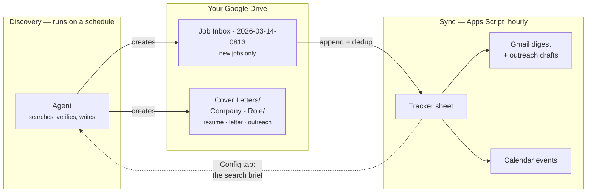

<h1 align="center">malik-finder</h1>

  <em>An autonomous job-hunt pipeline that lives entirely in your Google account.</em>

  
  
  
  

---

An agent searches for jobs twice a day, picks the right resume for each one,
writes a researched cover letter, and drafts the recruiter email. A Google Apps
Script merges all of it into one tracker spreadsheet, emails you a digest, and
puts your deadlines and interviews on your calendar.

You review and hit send. That is the whole job.

**No server, no database, no API keys, no monthly bill.** Everything runs on
infrastructure you already have: a Google Sheet, a Drive folder, and a scheduled
agent.

## What you actually get

| | |
| --- | --- |
| 🔎 **Scheduled discovery** | Searches on your own brief — role keywords, locations, target companies, and an exclusion list that filters out seniority you can't apply for. Every URL is fetched and verified before it reaches you; dead links never land in the tracker. |
| 📄 **Assets per job** | The best-matching resume from your set, a cover letter that references what the company actually builds, and a short outreach note — each in its own `Company - Role` Drive folder. |
| 📊 **One live tracker** | A 21-column sheet with status dropdowns, colour-coded pipeline stages, filters, and a dashboard tab: funnel chart, applications-this-week, follow-ups due, and a breakdown of which resume you're actually sending. |
| 📬 **Digest email** | After each sync: what's new, which resume was picked, links to the posting and the cover letter. |
| 🤝 **Guard-railed outreach** | Recruiter emails are **drafted, not sent**, until you flip a kill-switch — and even then only to addresses the agent found published, capped per run, once per job. |
| 📅 **Calendar automation** | Set status to `Applied` and the date stamps itself. Fill in an interview date and it appears on your calendar. Deadlines and 7-day follow-ups get reminders on their own. |

## How it works

Two halves that never touch the same file, joined by a Drive folder.

The split isn't arbitrary. The Drive connector an agent gets is **read + create
only** — no edit, no append, no delete. So the agent physically cannot modify
your tracker; it drops a new inbox sheet and walks away. The Apps Script, which
runs as *you* with full Sheets access, does the merge.

That constraint buys a real safety property: **a bad agent run cannot corrupt
your tracker.** Worst case is a junk sheet you delete by hand.

[Full architecture →](docs/ARCHITECTURE.md)

## Quick start

You need a Google account and any agent that can search the web and create files
in Drive. The reference setup uses a [Claude cloud routine](https://claude.ai/code/routines);
[other runners work too](routine/README.md#running-it-somewhere-else).

**1. Create the Drive layout** — a `Job Applications` folder, a `Cover Letters`
folder inside it, and a `Resumes` folder with one variant per career track. Note
each folder ID (the long string in its URL).

**2. Create the tracker** — a new Google Sheet. Then **Extensions › Apps Script**,
paste in [`apps-script/JobTrackerSync.gs`](apps-script/JobTrackerSync.gs), save,
and run `setup` once. Approve the OAuth prompt (*Advanced › Go to project › Allow* —
the "unverified app" warning is expected; the app is your own copy of the script).

**3. Fill in the Config tab** — `setup` creates it. At minimum set
**Your name** and **Job Applications folder ID**. Then **Job Finder › Check setup**
to confirm everything is wired up.

**4. Schedule the agent** — fill the placeholders in
[`routine/PROMPT.md`](routine/PROMPT.md) with your IDs and create the routine.
`13 12,23 * * *` UTC gives you 08:13 and 19:13 Eastern.

**5. Watch the first run** — trigger the routine manually, confirm a
`Job Inbox - …` sheet appears, then **Job Finder › Sync now**. Rows in the
tracker and a digest in your inbox means you're done.

Don't want to wait for a real run? [Test the sync with the sample inbox](examples/README.md#testing-the-sync-with-the-sample-inbox).

**[Detailed setup, with every screen →](docs/SETUP.md)**

## Configuration

Everything is edited from the `Config` tab of your own sheet — you never touch
source to change behaviour.

| Key | Default | What it does |
| --- | --- | --- |
| `Your name` | — | Signs recruiter outreach |
| `Job Applications folder ID` | — | **Required.** Folder the sync scans |
| `Target companies` | — | Prioritised in search; blank = anywhere |
| `Role keywords` | `Software Engineer, Machine Learning, Data` | The search brief |
| `Locations` | `Remote` | Where you'll work |
| `Exclusions` | `Senior, Staff, Principal, …` | Disqualifying titles and requirements |
| `Jobs per run` | `10` | Cap per scheduled run |
| `Recruiter auto-send` | `FALSE` | **Kill-switch.** `FALSE` = drafts only |
| `Max sends per run` | `5` | Send cap when auto-send is on |
| `Digest enabled` | `TRUE` | Email after each sync |
| `Digest recipient` | *(you)* | Where the digest goes |
| `Follow-up days` | `7` | Days after applying before a nudge |
| `Stale days` | `5` | Days before an unapplied job turns red |

[Every key in detail →](docs/CONFIGURATION.md) · [Tracker schema →](docs/SCHEMA.md)

## Safety and privacy

This thing has your Gmail, your Calendar, and your Drive. That is worth being
deliberate about.

- **Nothing leaves your Google account.** No third-party server, no telemetry,
  no analytics. The script runs under your own OAuth grant.
- **No secrets in the repo.** There is nothing to leak — no API keys, no service
  accounts, no `.env`. Your IDs live in your sheet, not in source.
- **Outreach is opt-in.** `Recruiter auto-send` defaults to `FALSE`, so
  everything is a Gmail draft until you decide otherwise. Even switched on:
  published addresses only, never guessed, capped per run, once per job.
- **The agent can't guess an email.** The prompt forbids constructing addresses
  from name patterns. Unpublished means blank.
- **Never commit your resumes.** `resumes/` and `*.xlsx` are gitignored for
  exactly this reason. Read [SECURITY.md](SECURITY.md) before you fork.

## Documentation

| | |
| --- | --- |
| [Setup](docs/SETUP.md) | Full walkthrough, first run to first digest |
| [Configuration](docs/CONFIGURATION.md) | Every Config key, with tuning advice |
| [Architecture](docs/ARCHITECTURE.md) | How the halves fit, dedup, idempotency, triggers |
| [Schema](docs/SCHEMA.md) | The 21 columns and who writes each one |
| [Discovery routine](routine/README.md) | The scheduled half, and how to run it elsewhere |
| [Troubleshooting](docs/TROUBLESHOOTING.md) | When it doesn't work |
| [FAQ](docs/FAQ.md) | Cost, scope, "why not just…" |

## Contributing

Contributions are welcome — especially alternative runners for the discovery
half, job-board coverage, and anything that makes setup shorter.

Start with [CONTRIBUTING.md](CONTRIBUTING.md); it covers testing Apps Script
changes without wrecking your own tracker. Everyone is expected to follow the
[Code of Conduct](CODE_OF_CONDUCT.md).

Good first issues: a `clasp`-based dev loop, a GitHub Actions runner for
discovery, per-source dedup improvements, an "archive rejected rows" action.

## License

[MIT](LICENSE) © malik-finder contributors
