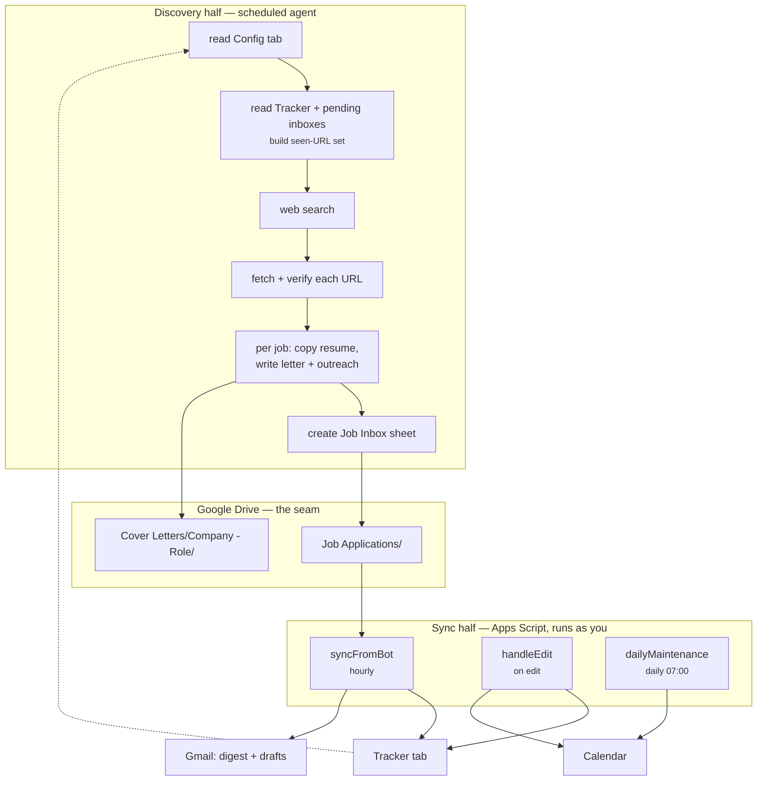

# Architecture

## The constraint that shaped everything

The Google Drive connector available to a scheduled agent is **read + create**.
No edit. No append. No delete.

So the obvious design — "agent appends rows to my tracker" — is simply not
available. What the agent *can* do is create a new file. Hence:

> The agent writes an inbox. Something that runs as you merges it.

That something is a container-bound Apps Script, which executes under your own
OAuth grant and therefore has full Sheets, Gmail, Drive, and Calendar access.

The constraint turned out to be a feature. Because the discovery half is
structurally incapable of touching the tracker, **no agent run can corrupt your
data.** The worst possible outcome is a junk sheet you delete. Every destructive
capability sits in the deterministic half, where behaviour is reviewable code
rather than a model's judgment.

## Components

| Piece | Lives in | Runs as | Job |
| --- | --- | --- | --- |
| Discovery routine | Your scheduler | The connector's grant | Find, verify, write assets, emit inbox |
| `Job Inbox - <ts>` sheets | Drive | — | The message queue between halves |
| `JobTrackerSync.gs` | The tracker sheet | You | Merge, notify, automate |
| `Config` tab | The tracker sheet | — | Shared settings both halves read |

There is no direct call between the halves. Either can be down, replaced, or
run by hand without the other noticing — the folder is the only interface.

## Data flow

### Discovery, per scheduled run

1. Read `Config` for the search brief.
2. Build the seen-set: every `Link to Job Req` in `Tracker` **plus** every
   pending (non-`[synced]`) inbox sheet, plus existing `Company - Role`
   cover-letter folders.
3. Search, filtered by `Exclusions`.
4. Fetch every candidate URL. 404, redirect-to-index, or "closed" means discard —
   a link that isn't verified never ships.
5. For each survivor: copy the best-matching resume, write a researched cover
   letter, write an outreach note, all into `Cover Letters/<Company> - <Role>/`.
6. Create one `Job Inbox - YYYY-MM-DD-HHmm` sheet with the
   [21-column schema](SCHEMA.md).

Step 2 is why two runs can queue up without duplicating: an inbox that hasn't
been synced yet still counts as seen.

### Sync, hourly

1. Read `Config`; bail with a toast if `Job Applications folder ID` is unset or
   unopenable.
2. Load every `Link to Job Req` already in `Tracker` into a hash set.
3. Scan the folder for Google Sheets named `Job Inbox*` without `[synced]`.
4. For each row: skip if the URL is blank or already in the set; otherwise add it
   to the set and queue the row. The in-memory set updates as it goes, so
   duplicates *within* a batch collapse too.
5. Append the queue in one `setValues` call.
6. Reapply formatting — dropdowns, status colours, the stale rule, the filter.
7. Rename each consumed file `[synced] <name>`.
8. If rows were added and digests are on, email the digest.
9. Run outreach over every `Pending` row.

### Reactive and daily

`handleEdit` (installable, so it can write and call Calendar):
- `Application Status` → `Applied` stamps `Date Submitted`, if empty.
- `Interview Date` filled creates an all-day calendar event.

`dailyMaintenance` at 07:00:
- A future `Deadline` gets a reminder event.
- An `Applied` row past `Follow-up days` gets a "Follow up" event.

## Idempotency

The system re-runs constantly, so every write is guarded.

| Operation | Guard | Effect of running twice |
| --- | --- | --- |
| Append rows | URL hash set, built fresh each sync | Nothing |
| Consume an inbox | `[synced]` rename | Skipped |
| Send digest | Only when rows were actually added | No email |
| Send outreach | Status flips `Pending` → `Sent`/`Drafted` | Nothing |
| Create calendar event | `evt_<kind>_<key>` in Document Properties | Nothing |
| `setup` | Header rewrite is destructive-safe; `Config` is never overwritten | Same state |

`setup` is deliberately safe to re-run — it's the upgrade path.

**Dedup key: `Link to Job Req`.** One URL, one row, forever. The trade-off is
that a job posted at two URLs lands twice; matching on company+role instead
would silently drop legitimately distinct roles, which is the worse failure.
The agent covers the gap on its side by also checking cover-letter folder names.

## Trigger topology

| Trigger | Type | Handler | Why that cadence |
| --- | --- | --- | --- |
| Hourly sync | Time, 1h | `syncFromBot` | Inboxes appear twice daily; hourly means ≤1h latency at trivial quota cost |
| Edit | Installable, on-edit | `handleEdit` | Must be installable — simple `onEdit` can't call Calendar |
| Daily | Time, 07:00 | `dailyMaintenance` | Reminders should land before the workday |

Installed by `ensureTriggers_`, which checks handler names first, so re-running
`setup` never stacks duplicates.

## Failure modes

Everything user-visible degrades rather than throws.

| Failure | Behaviour |
| --- | --- |
| Folder ID missing or bad | Toast, sync returns; no partial state |
| Inbox sheet malformed | Rows with a blank URL are skipped; the rest import |
| Outreach doc unreadable | Falls back to a generated body |
| Gmail send fails | Row marked `Skipped`, sync continues |
| Draft creation fails | Row stays `Pending`, retried next hour |
| Calendar unavailable | Swallowed; the property isn't set, so it retries |
| Chart insert fails | Caught; the dashboard tables still build |

The deliberate asymmetry: a *send* failure is terminal for that row
(`Skipped` — you'll see it), while a *draft* failure is retried. Sending twice
is worse than not drafting once.

## What isn't here

- **No state outside Google.** No database, no server, no cache. The sheet is
  the database; Drive is the queue; Document Properties is the dedup log.
- **No secrets.** Nothing to rotate, leak, or put in CI.
- **No package to install.** The "deployment" is pasting a file into a sheet.
- **No tests.** Apps Script has no local runtime and the whole file is I/O
  against Google services. See
  [CONTRIBUTING.md](../CONTRIBUTING.md#testing-changes) for how changes are
  actually verified — and [open an issue](https://github.com/rajvardhan19/malik-finder/issues)
  if you want to fix this.
